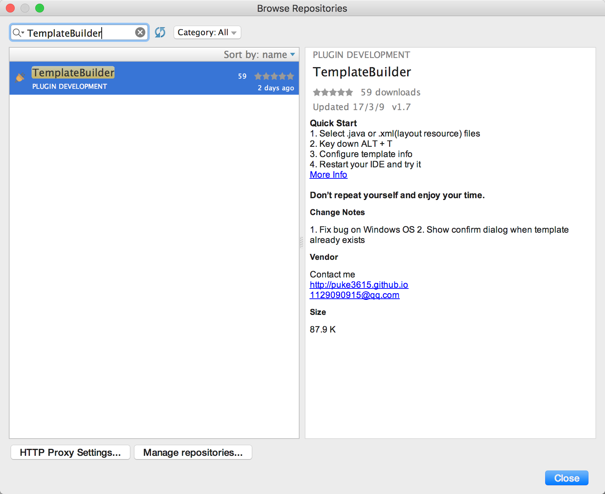
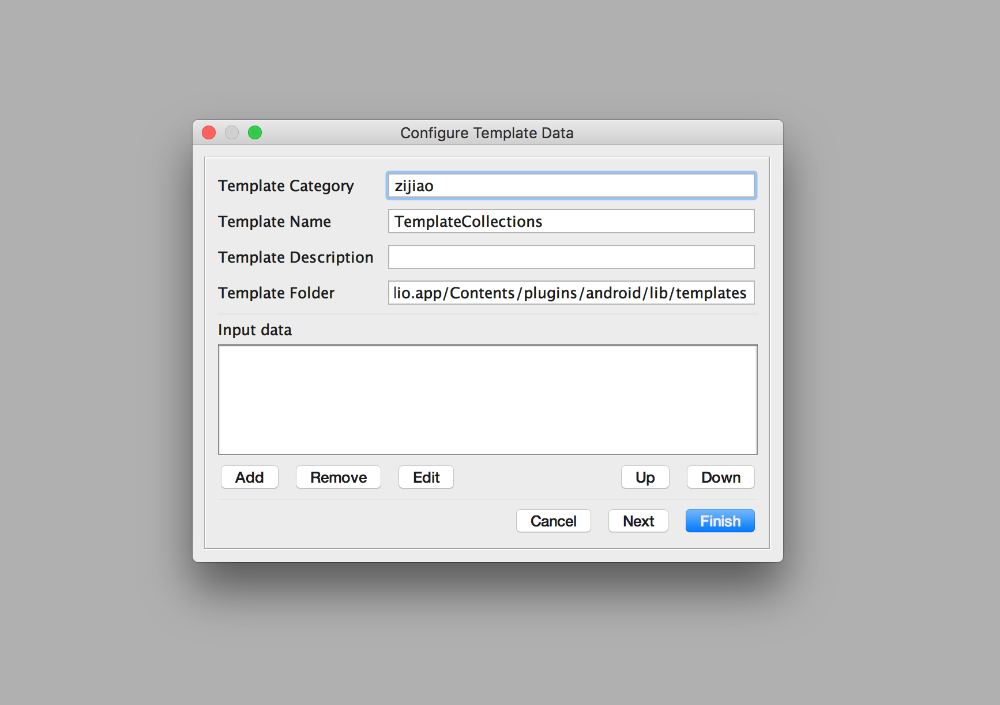
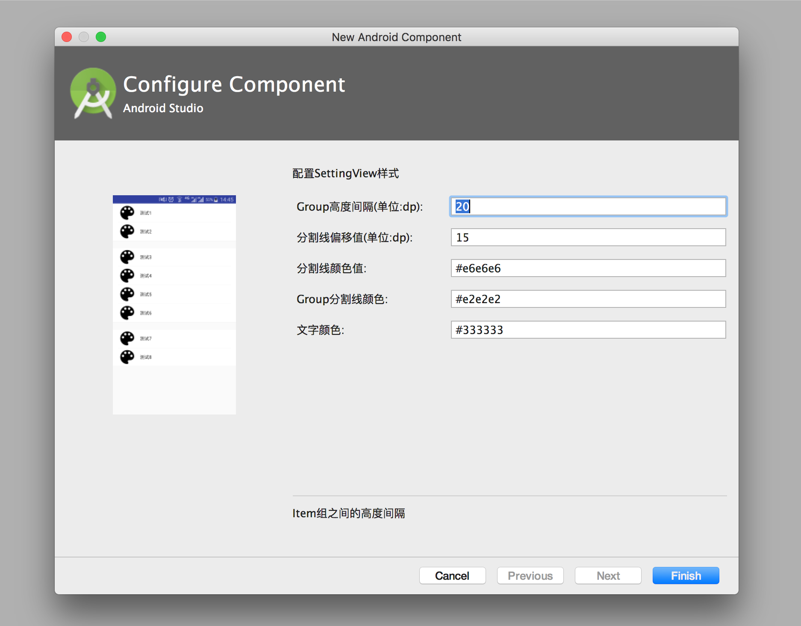
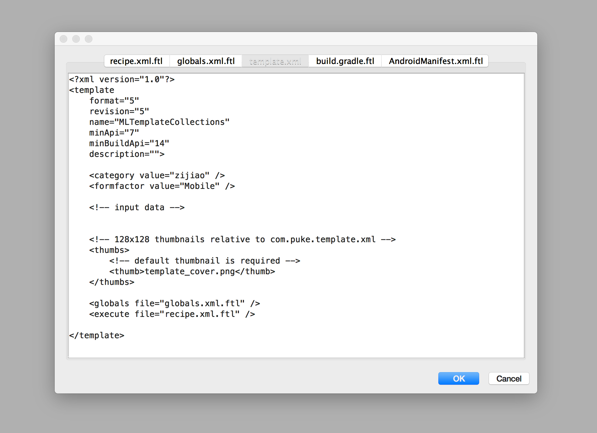

[中文版](doc/md/README中文版.md)

> `Statement`
>
> Android Studio templates include the following three, here is the third Multi Template. Before reading this article, Acquiescence you know the template, know why to use it, if it is not clear what it is, you can check the relevant information online, of course, you can also [click here](https://puke3615.github.io/2017/03/10/Android%20Studio%20Template/) to see the peer to its evaluation
>
> - Live Template：Code snippet level
> - File Template：Single file level
> - Multi Template：Multiple file levels (hereinafter referred to as `Android Studio Template`)

## WHAT

TemplateBuilder is an AS plug-in that can help us to quickly generate Android Studio Template, through a file to configure the template to improve the way through the plug-in to achieve, for simple template production, only one button can be generated.

## HOW

#### Install

Open Android Studio, `Preferences` -- `Plugins` -- `Brown Repositories`, search `TemplateBuilder` and download, then restart the IDE and try.

#### Instructions

Here we take an example of the extraction of an MVP template, first select the need to create a template for the template file (if you need to select a package below all the files, you can directly select the package), and then press the shortcut `ALT + T` to start the plug, you can see the following interface

Here to explain the corresponding content of the interface

* `Template Category`  Corresponding to the template classification, corresponding to select the template template when the import, where the default is the computer's user name.

* `Template Name`  Corresponding to the template name, corresponding to the template name when selecting the import template, the default is the current Project name.

* `Template Description`  Corresponding to the template description information, corresponding to the template when the import interface pop-up description of the text, the default is empty.

* `Template Folder`  Corresponding to the location generated by the template, if the Mac operating system is the default / `Applications / Android Studio.app/Contents/plugins/android/lib/templates`, Windows OS, because the difference is relatively large, the default is empty, you can Configure the `[Android Studio installation directory] / plugins / android / lib / templates `(here only need to configure once, the plugin will automatically save the location).

* `Input data area`  If you want to enhance the compatibility of the template will use it, it corresponds to the AS template Template.xml <parameter /> tag, that is, each of the following configuration items.

  

The whole UI interface is clear, if you just want to simply extract the template you write, you only need to enter the `Template Name` and `Template Description` can, of course, if you do not want to enter this can also be omitted. Then click `Finish`, you can see the bottom of the IDE pop-up as shown below the prompt, then you have been successful, restart the IDE to use the template.

Here, if you understand the `Android Studio Template` production process, you may feel that compared to their own manual to do this is simple, but the flexibility to reduce a lot. For example, when there is a group dependency in the template, you need to add the corresponding dependencies in `build.gradle.ftl`. After importing the template, you will need to edit `recipe.xml.ftl` when you want to open a file automatically. In which version, you need to edit `template.xml` and so on. If you have this need, you can click `Next` to replace the `Finish`, click on the following you will be able to see the following interface, where you need to focus on all the configuration file editing, editing directly click `OK` to start automatically generated.

## WHY

If you try to make your own `Android Studio Template`, I believe you will be for the template configuration, change the file name, add the parameters can be complicated, and so cumbersome operation and worry, because even a very simple template extraction need to put this A series of processes all go again, change several configuration files.

Say my personal feelings, when I found `Android Studio Template` I suddenly felt there are too many can be extracted out of the template for future rapid use, but when I first started to extract a few templates when it has been deep Disgusted, because this process is very tedious. Remember to also write groovy script to assist in the configuration of these templates, but still need to add some template to the script file entry information, still very troublesome. Later, I decided to make this process as much as possible through the automation to complete, then consider the `Gradle plug-in`, `Java GUI`, `AS Plugin` and other ways to complete the template production, the final choice of a quick and convenient `AS Plugin`, plug-in name is mentioned above To the `TemplateBuilder`.

